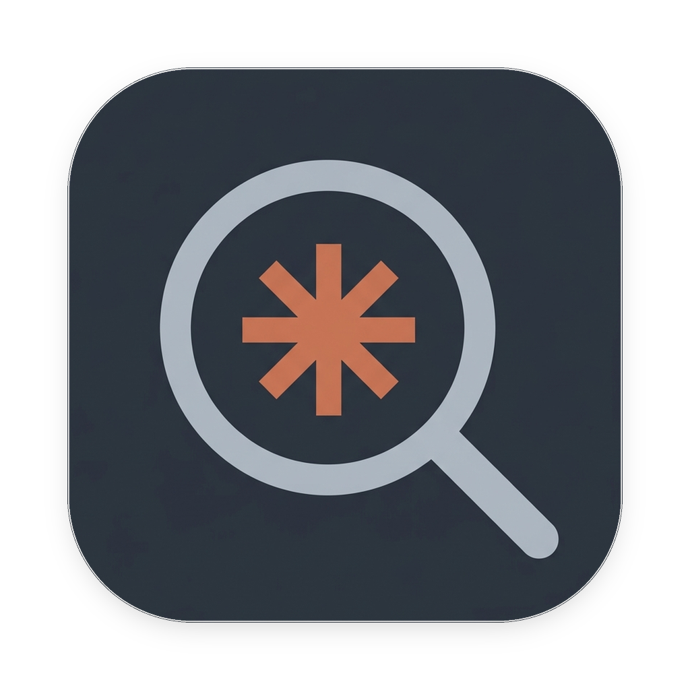
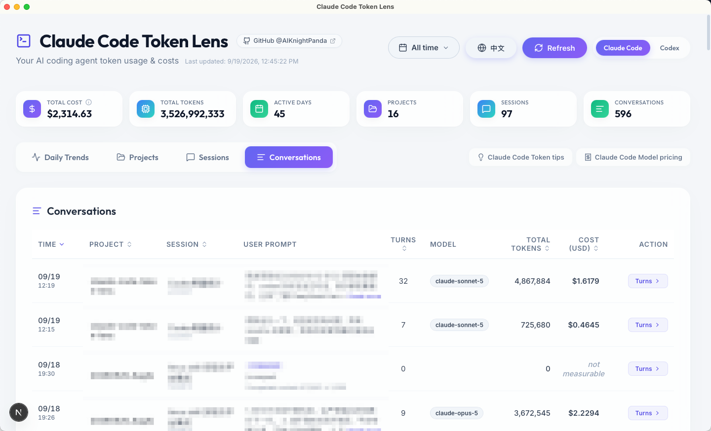
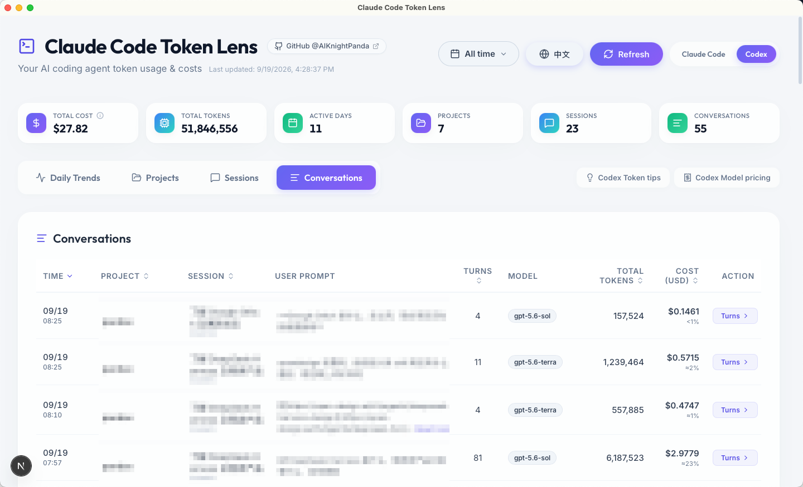

<p align="center">
  
</p>

<h1 align="center">Claude Code Token Lens</h1>

<p align="center">
  <a href="./README_zh.md">🇨🇳 中文版 (Chinese Version)</a>
</p>

**Claude Code Token Lens** is a local desktop app that shows what your Claude Code and Codex usage actually costs — by project, by session, and by every single conversation. Once the expensive conversations sit next to the cheap ones, you can see what you did differently, and stop burning tokens on it.

## 🎯 Why this exists

Claude Code and Codex tell you how many tokens a conversation used. They never tell you what that was worth, or how it compares to the prompt before it. The usage happens, and then it's gone. This gives you the number back — and something to compare it against.

## ✨ Features

- 🧩 **Claude Code and Codex, side by side**: One tab each. Every side has its own parser, cache and price table, so a problem on one never affects the other.
- 🔍 **Follow the money down the project hierarchy**: Project → Session → Conversation → Turn, each level a sortable list. Totals are identical at every level, so a project's cost is exactly the sum of the prompts inside it.
- 💵 **Consumption in money, Codex quota at a glance**: Every row carries a cost. For Codex subscriptions, each conversation also shows an estimate of the share of your 5-hour quota it used, and each call shows how much 5-hour and weekly quota was left when it started.
- 🧾 **Prices from official data**: The *Model pricing* button lists the exact per-model rates behind every number, calculated from official pricing and dated by when they were last checked (Codex prices are estimates, see below).
- 💡 **Token-saving tips**: A short, numbered list of habits that cut cost, written separately for Claude Code and Codex, each with a collapsible "why".
- 🔒 **Secure by design, your logs stay on your machine**: The app can only read your session logs (`~/.claude/projects/`, `~/.codex/sessions`, `~/.codex/archived_sessions`), never modify them, and makes no network requests of its own: no upload, no telemetry. Both limits are enforced by the Rust backend and the window's content-security policy, not just by the UI.
- ⚡ **Fast on large logs**: The first launch scans everything and caches it; later refreshes read only the bytes appended since. Session logs of 60MB+ open without a stall.

## 🖼 Preview

**Claude Code**



**Codex**



## 🚀 Getting Started

It ships as a desktop app (built with [Tauri](https://tauri.app/)). No server, no browser tab, no Node.js on your machine.

### Download

Grab the latest installer from the [Releases page](https://github.com/AIKnightPanda/claude-code-token-lens/releases):

| Platform | File |
|---|---|
| macOS (Apple Silicon **and** Intel) | `Claude Code Token Lens_<version>_universal.dmg` |
| Windows 10/11 (x64) | `Claude Code Token Lens_<version>_x64-setup.exe` (or the `.msi`) |

The macOS build is signed with a Developer ID certificate and notarized by Apple, so it opens with a
double-click. The Windows build is unsigned — on the SmartScreen dialog, click *More info* → *Run anyway*.

On first launch the app scans `~/.claude/projects/` and `~/.codex/`, then caches the result; later refreshes only read the bytes appended since the last run.

### Build from source

Prerequisites: [Node.js](https://nodejs.org/) 18+, the [Rust toolchain](https://rustup.rs/), and the platform's
build tools ([Xcode Command Line Tools](https://developer.apple.com/xcode/resources/) on macOS,
[MSVC + WebView2](https://tauri.app/start/prerequisites/) on Windows).

```bash
git clone https://github.com/AIKnightPanda/claude-code-token-lens.git
cd claude-code-token-lens
npm install

npm run tauri:dev     # run the desktop app with hot reload
npm run tauri:build   # produce an installer in src-tauri/target/release/bundle/
```

To check the numbers yourself (runs in Node against the same parser the app uses):

```bash
npm run verify          # Claude Code
npm run verify:codex    # Codex
```


## ⚙️ Configuration

The desktop app needs no configuration. These environment variables only affect the Node-side
tooling (`npm run verify`) and the defaults compiled into the app.

| Variable | Default | Purpose |
|---|---|---|
| `CLAUDE_PROJECTS_DIR` | `~/.claude/projects` | Where to read logs from |
| `TOKEN_LENS_DEDUP_SCOPE` | `global` | `global` also removes history replayed into a new file by resume/fork; `session` counts each session on its own (matches ccusage) |
| `TOKEN_LENS_STORE_PROMPTS` | `true` | Set to `false` to keep no prompt text on disk |
| `TOKEN_LENS_PROMPT_MAX_CHARS` | `10000` | Characters kept per prompt |
| `CODEX_HOME` | `~/.codex` | Where to read Codex logs from |
| `TOKEN_LENS_CODEX_STORE_PROMPTS` | `true` | Codex counterpart of `TOKEN_LENS_STORE_PROMPTS` |
| `TOKEN_LENS_CODEX_PROMPT_MAX_CHARS` | `10000` | Codex counterpart of `TOKEN_LENS_PROMPT_MAX_CHARS` |

## 🔒 Privacy

The app makes **no outbound network requests** — nothing is uploaded, and there is no telemetry. Two things are worth knowing anyway:

- **The app only ever reads `~/.claude/projects/` and `~/.codex/sessions` / `~/.codex/archived_sessions`.** That restriction is enforced in Rust, not in the UI: the desktop build exposes no general file-system API to the web layer, and every read is checked against those directories.
- **The cache holds prompt text.** `usage_cache.json` (and `codex_usage_cache.json` for Codex) keeps the first 10,000 characters of each prompt so the Conversations view can show them. It lives in the app data directory —
  `~/Library/Application Support/com.aiknightpanda.claude-code-token-lens/` on macOS,
  `%APPDATA%\\com.aiknightpanda.claude-code-token-lens\\` on Windows — and deleting that folder clears everything the app has stored. The per-session files under `turns/` and `codex_turns/` only ever contain token counts.
- **Deleting a log does not delete its stats.** Logs do disappear: Claude Code deletes terminal (CLI) session logs after 30 days of inactivity by default, and you can delete sessions yourself. So the app keeps what it has already counted and marks the session *Log deleted* — otherwise your history would quietly shrink. Those rows get a trash button (Claude Code only for now) that deletes the cached record for good, prompt text and turn details included. Rows whose log still exists have no such button: the log is the source of truth, and anything deleted from the cache would simply come back on the next sync.

## 📐 How costs are computed

**These are API-equivalent costs.** They are derived from token counts at published API rates. On a Pro/Max subscription you are not billed per token, so read the number as a measure of usage scale, not as an invoice.

**Codex costs are estimates.** Codex is a subscription product with no published per-token price list, so the app prices it at the OpenAI API rates of the same model generation (cache reads at 10% of the input rate, cache writes at the plain input rate). Open the *Model pricing* dialog to see every rate and the date it was last checked.

**Sub-agents are counted under the prompt that launched them.** Both Claude Code and Codex write each sub-agent's calls to a separate log file. The app folds them back into the parent session and the prompt that was running when they were spawned, and marks each of those calls with the sub-agent's name in the Turns view — so one prompt shows what it really cost, fan-out included.

**Side chats in the Claude desktop app are not counted.** The desktop app runs them without writing a log, so there is nothing on disk to read. They aren't cheap either: every side-chat message resends the parent session's full context.

## 🙏 Acknowledgements / Inspiration

This project was inspired by the need to track API costs generated by autonomous coding agents. The initial parser logic was inspired by community efforts to demystify local `.jsonl` logs generated by tools like Claude Code.

## 📄 License

This project is licensed under the MIT License - see the [LICENSE](LICENSE) file for details.
