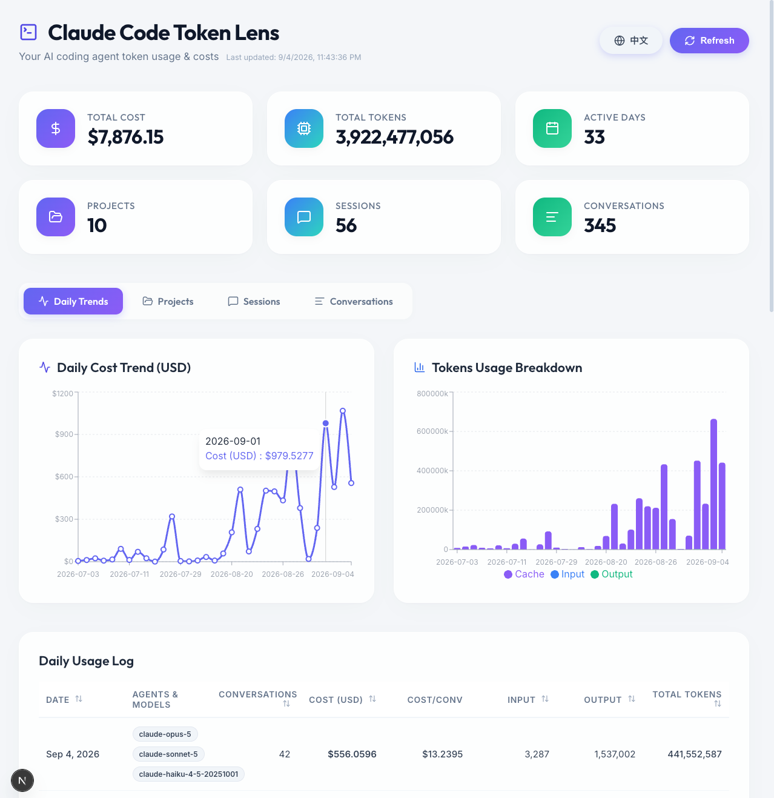

# Claude Code Token Lens

[🇺🇸 English Version](./README.md)



**Claude Code Token Lens** 是一款美观、本地优先的 AI 编程助手 Token 使用量追踪器和分析面板。

本项目最初为了解析 **Claude Code** 的本地日志而构建，其底层架构设计具备平台不可知性（Platform-agnostic），未来可以轻松支持其他 AI 编程助手（如 Cursor、Aider、GitHub Copilot CLI 等）。它能汇总 Token 使用量、精确计算 API 成本，并通过丰富的交互式下钻功能（项目 > 会话 > 对话 > 轮次），将每日使用趋势可视化呈现。

## ✨ 特性

- 🔒 **本地优先 & 安全**：完全在您的本地机器上运行。它只读取您代理的本地 JSON 日志，绝不会将您的私有代码库或提示词（Prompt）历史发送到任何外部服务器。您的数据只属于您自己。
- 📊 **详细的分析面板**：通过充满现代感、毛玻璃（Glassmorphism）风格的 UI，一眼查看总成本、Token 消耗量以及活跃天数。
- 📈 **每日趋势与聚合**：精美的柱状图和折线图，直观展示每天的输入/输出/缓存 Token 和成本。
- 🔍 **深度下钻 UI**：无缝过滤和导航，层级支持 **项目** -> **会话** -> **对话** -> **具体单次交互**。
- 🏷️ **智能过滤**：内联过滤标签，让您清晰知道当前查看的数据上下文，并支持一键清除。
- 💵 **成本追踪**：采用最新的定价模型（如 Claude 3.5 Sonnet），基于实际用量准确计算您的 API 成本。

## 🚀 快速开始

### 环境要求

- [Node.js](https://nodejs.org/) 18 或更高版本
- 本地 AI Agent 日志（目前支持由 Claude Code 生成的 `~/.claude/projects/*.jsonl`）

### 安装步骤

1. 克隆仓库：
   ```bash
   git clone https://github.com/AIKnightPanda/claude-code-token-lens.git
   cd claude-code-token-lens
   ```

2. 安装依赖：
   ```bash
   npm install
   # 也可以使用 yarn install 或 pnpm install
   ```

### 使用方法

1. 启动本地开发服务器：
   ```bash
   npm run dev
   ```

2. 在浏览器中打开 [http://localhost:3000](http://localhost:3000) 即可访问您的个人使用量看板。应用会自动扫描您的本地 `.claude` 日志目录并渲染数据。

## 🛣️ 路线图

- [x] 支持 Claude Code (`.claude/projects/`) 日志解析
- [ ] 增加对 Cursor AI 日志的支持
- [ ] 增加对 Aider 日志的支持
- [ ] 自定义定价配置界面
- [ ] 日期范围过滤（如：最近 7 天、本月）

## 🙏 致谢 / 灵感来源

本项目的灵感来自于对自动化编程助手所产生的 API 成本进行追踪的迫切需求。初始的解析逻辑受启发于社区为了解 Claude Code 等工具生成的本地 `.jsonl` 日志所做的努力。

## 📄 许可证

本项目基于 MIT 许可证开源 - 详情请参阅 [LICENSE](LICENSE) 文件。
