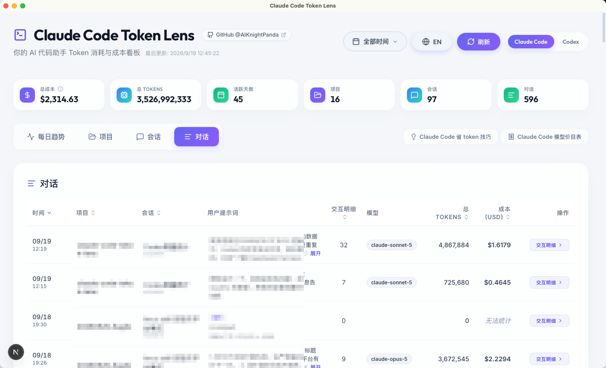
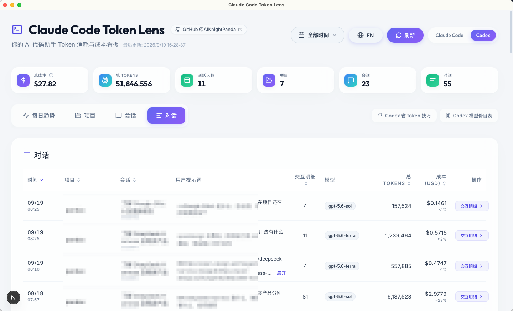

<p align="center">
  
</p>

<h1 align="center">Claude Code Token Lens</h1>

<p align="center">
  <a href="./README.md">🇺🇸 English Version</a>
</p>

**Claude Code Token Lens** 是一个本地桌面应用，把你用 Claude Code 和 Codex 的花费按**项目、会话、每一次对话**逐层拆开给你看。当贵的对话和便宜的并排放在一起，你就能看出当时做了什么不一样的事，然后别再那样浪费 token。

## 🎯 为什么做这个

Claude Code 和 Codex 只会告诉你这次对话消耗了多少 token，从不告诉你这值多少钱，也不告诉你和上一条比是多还是少。用量就这么产生了，然后消失了。这个工具把这个数字还给你，并给你一个可以对比的参照。

## ✨ 特性

- 🧩 **Claude Code 和 Codex 并排看**：顶部标签页一键切换。两边各有独立的解析器、缓存和价目表，一边出问题不会影响另一边。
- 🔍 **按项目层级建立展示链路**：项目 → 会话 → 对话 → 交互，每一层都是一张可排序的列表。每一层的合计都严格相等，一个项目的花费就是它里面所有提示词加起来的数。
- 💵 **用钱表示消耗，Codex 额度一目了然**：每一行都带成本。Codex 订阅用户还能看到每条对话预估占了多少 5 小时额度，以及每次调用开始时 5 小时和每周额度还剩多少。
- 🧾 **价目表来自官方数据**：「模型价目表」按钮列出每个模型的具体单价，按官方价目计算，并标注最后一次核对的日期（Codex 的价格是估算值，见下文）。
- 💡 **省 token 小技巧**：一份带编号的简短清单，Claude Code 和 Codex 分别撰写，每条都带可收起的「为什么」。
- 🔒 **安全设计，日志不出本机**：应用只能读取你的会话日志（`~/.claude/projects/`、`~/.codex/sessions`、`~/.codex/archived_sessions`），不会修改它们，自身也不发起任何网络请求：不上传，没有遥测。这两条限制由 Rust 后端和窗口的内容安全策略强制执行，而不只是靠界面约束。
- ⚡ **大日志也不卡**：首次启动全量扫描并缓存，之后只读新追加的字节。单个 60MB+ 的会话日志照样秒开。

## 🖼 界面预览

**Claude Code**



**Codex**



## 🚀 快速开始

本项目以桌面应用形式分发（基于 [Tauri](https://tauri.app/) 打包），不需要起服务、不占浏览器标签页，本机也不需要装 Node.js。

### 下载安装

到 [Releases 页面](https://github.com/AIKnightPanda/claude-code-token-lens/releases) 下载对应安装包：

| 平台 | 文件 |
|---|---|
| macOS（Apple 芯片与 Intel 通用） | `Claude Code Token Lens_<版本>_universal.dmg` |
| Windows 10/11（x64） | `Claude Code Token Lens_<版本>_x64-setup.exe`（或 `.msi`） |

macOS 版用 Developer ID 证书签名并经过 Apple 公证，双击即可打开。
Windows 版未签名，SmartScreen 弹窗里点「更多信息」→「仍要运行」即可。

首次启动会扫描 `~/.claude/projects/` 和 `~/.codex/` 并缓存结果；之后的刷新只读取上次之后新追加的字节。

### 从源码构建

环境要求：[Node.js](https://nodejs.org/) 18+、[Rust 工具链](https://rustup.rs/)，以及各平台的构建工具
（macOS 需要 [Xcode Command Line Tools](https://developer.apple.com/xcode/resources/)，
Windows 需要 [MSVC 与 WebView2](https://tauri.app/start/prerequisites/)）。

```bash
git clone https://github.com/AIKnightPanda/claude-code-token-lens.git
cd claude-code-token-lens
npm install

npm run tauri:dev     # 带热更新地跑桌面端
npm run tauri:build   # 产出安装包，在 src-tauri/target/release/bundle/ 下
```

想自己核对数字（在 Node 里跑，用的是和应用完全相同的解析代码）：

```bash
npm run verify          # Claude Code
npm run verify:codex    # Codex
```


## ⚙️ 配置

桌面应用开箱即用，无需配置。下面这些环境变量只对 Node 侧的工具链（`npm run verify`）
以及编译进应用的默认值生效。

| 变量 | 默认值 | 作用 |
|---|---|---|
| `CLAUDE_PROJECTS_DIR` | `~/.claude/projects` | 从哪里读取日志 |
| `TOKEN_LENS_DEDUP_SCOPE` | `global` | `global` 会连 resume/fork 重放进新文件的历史一并消除；`session` 让每个会话独立计数（与 ccusage 一致） |
| `TOKEN_LENS_STORE_PROMPTS` | `true` | 设为 `false` 则不在磁盘上保留任何提示词文本 |
| `TOKEN_LENS_PROMPT_MAX_CHARS` | `10000` | 每条提示词保留的字符数 |
| `CODEX_HOME` | `~/.codex` | 从哪里读取 Codex 日志 |
| `TOKEN_LENS_CODEX_STORE_PROMPTS` | `true` | Codex 侧对应 `TOKEN_LENS_STORE_PROMPTS` |
| `TOKEN_LENS_CODEX_PROMPT_MAX_CHARS` | `10000` | Codex 侧对应 `TOKEN_LENS_PROMPT_MAX_CHARS` |

## 🔒 隐私

本应用**不发起任何对外网络请求** —— 不上传数据，也没有任何遥测。但有两点仍需知悉：

- **应用只会读 `~/.claude/projects/` 以及 `~/.codex/sessions`、`~/.codex/archived_sessions`。** 这条限制写在 Rust 侧而不是界面里：桌面端没有向网页层暴露任何通用的文件系统接口，每一次读取都会先校验路径是否在这些目录内。
- **缓存中含提示词原文。** `usage_cache.json`（Codex 对应 `codex_usage_cache.json`）会保存每条提示词的前 10,000 个字符，供「对话」页展示。它存放在应用数据目录下 ——
  macOS 是 `~/Library/Application Support/com.aiknightpanda.claude-code-token-lens/`，
  Windows 是 `%APPDATA%\\com.aiknightpanda.claude-code-token-lens\\` —— 删掉这个目录就能清空应用存下的所有内容。`turns/` 和 `codex_turns/` 下的分片文件只含 token 数字，不含任何文本。
- **删掉日志不会删掉统计。** 原始日志确实会消失：Claude Code 默认会删掉 30 天未活动的终端（CLI）会话日志，你也可能手动删掉会话。所以应用会保留已经统计过的数据，并把会话标成「原始日志已删除」—— 否则历史数据会悄悄变少。这类记录的行上有删除按钮（目前仅 Claude Code 侧提供），可以把缓存记录连同提示词原文和交互明细彻底删掉。原始日志还在的行没有这个按钮：数据以原始日志为准，从缓存里删了，下次同步也会回来。

## 📐 成本是怎么算出来的

**这里显示的是「等价 API 成本」**：按官方 API 价目从 token 数推算而来。如果你用的是 Pro/Max 订阅，实际并不按 token 计费，所以这个数字应当理解为**用量规模**，而不是账单金额。

**Codex 的成本是估算值。** Codex 是订阅制产品，官方没有公开分 token 的价目表，所以这里按 OpenAI API 同代模型的价格折算（缓存读取按输入价的 10%，缓存写入按普通输入价）。打开「模型价目表」可以看到每一项单价和最后核对的日期。

**子 agent 的开销算在派出它的那条提问下。** Claude Code 和 Codex 都会把每个子 agent 的调用写进单独的日志文件。应用会把它们并回父会话、并挂到派出它时正在进行的那条提问上，在「交互」页里用子 agent 的名字标出每一次调用 —— 这样一条提问的花费就是它的真实花费，包括派出子 agent 的那部分。

**Claude 桌面端的 side chat 不在统计范围内。** 桌面端运行 side chat 时不写日志，磁盘上没有可读的数据。它也并不便宜：每发一条 side chat 消息，都要把主会话的全部上下文重新发一遍。

## 🙏 致谢 / 灵感来源

本项目的灵感来自于对自动化编程助手所产生的 API 成本进行追踪的迫切需求。初始的解析逻辑受启发于社区为了解 Claude Code 等工具生成的本地 `.jsonl` 日志所做的努力。

## 📄 许可证

本项目基于 MIT 许可证开源 - 详情请参阅 [LICENSE](LICENSE) 文件。
