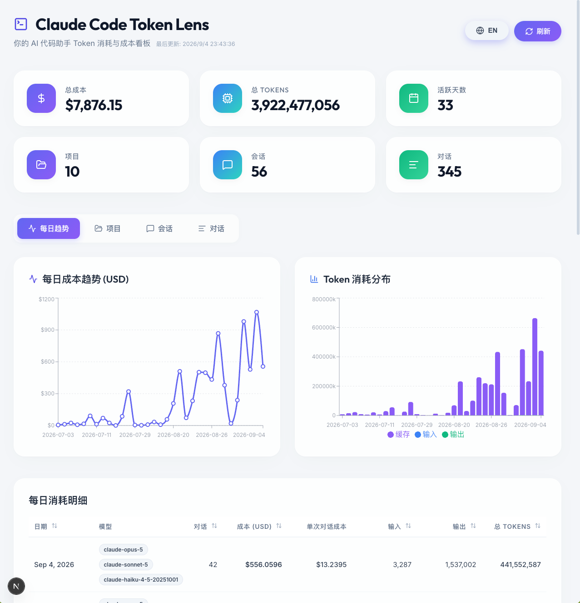

# Claude Code Token Lens

[🇺🇸 English Version](./README.md)



**Claude Code Token Lens** 是一款美观、本地优先的 AI 编程助手 Token 使用量追踪器和分析面板。

本项目最初为了解析 **Claude Code** 的本地日志而构建，其底层架构设计具备平台不可知性（Platform-agnostic），未来可以轻松支持其他 AI 编程助手（如 Cursor、Aider、GitHub Copilot CLI 等）。它能汇总 Token 使用量、精确计算 API 成本，并通过丰富的交互式下钻功能（项目 > 会话 > 对话 > 轮次），将每日使用趋势可视化呈现。

## 🎯 为什么做这个

用 Claude Code 的时候，它不会告诉你花了多少钱。这次对话消耗了多少？比上一次多还是少？哪个项目在悄悄吃掉你这个月的额度？都看不到。用量就这么产生了，然后消失了。

这个工具把这个数字还给你，更重要的是给你一个**可以对比的参照**：

- **每个项目** —— 到底哪个仓库最烧钱
- **每个会话** —— 一次坐下来干完的活，总共花了多少
- **每次对话** —— 你发的那一条提示词花了多少，和其他所有对话并排列着
- **每次交互** —— 下钻进去，看清钱具体花在这次对话的哪一步

因为都在同一张可排序的列表里，一次贵得离谱的对话就不再是个谜 —— 你能把它和便宜的那些放在一起看，找出差别在哪。而且每一层的合计都严格相等：一个项目的花费，就是它里面所有提示词加起来的数。

## ✨ 特性

- 🔒 **本地优先 & 安全**：完全在您的本地机器上运行。它只读取您代理的本地 JSON 日志，绝不会将您的私有代码库或提示词（Prompt）历史发送到任何外部服务器。您的数据只属于您自己。
- 📊 **详细的分析面板**：通过充满现代感、毛玻璃（Glassmorphism）风格的 UI，一眼查看总成本、Token 消耗量以及活跃天数。
- 📈 **每日趋势**：成本趋势折线加每日消耗明细，可按近 7 天 / 30 天筛选。
- ⚖️ **用量 vs 成本**：把 token 占比和成本占比并排对照。缓存读取常年占到 token 总量的约 98%，却只花掉一小部分钱；输出 token 恰好相反。这张图把这种错位以及各档位的有效单价直接画出来。
- 🔍 **深度下钻 UI**：无缝过滤和导航，层级支持 **项目** -> **会话** -> **对话** -> **具体单次交互**。
- 🏷️ **智能过滤**：内联过滤标签，让您清晰知道当前查看的数据上下文，并支持一键清除。
- 💵 **准确的成本核算**：剔除日志中重复记录的 `usage`，区分 5 分钟与 1 小时缓存写入的不同费率，并计入 fast 模式与服务端工具的计费。
- ✅ **可自证**：`npm run verify` 会用一条独立的代码路径从原始日志重算全部数字，并断言各聚合层级完全一致。

## 🚀 快速开始

本项目以桌面应用形式分发（基于 [Tauri](https://tauri.app/) 打包），不需要起服务、不占浏览器标签页，本机也不需要装 Node.js。

### 下载安装

到 [Releases 页面](https://github.com/AIKnightPanda/claude-code-token-lens/releases) 下载对应安装包：

| 平台 | 文件 |
|---|---|
| macOS（Apple 芯片与 Intel 通用） | `Claude Code Token Lens_<版本>_universal.dmg` |
| Windows 10/11（x64） | `Claude Code Token Lens_<版本>_x64-setup.exe`（或 `.msi`） |

macOS 版用 Developer ID 证书签名并经过 Apple 公证，双击即可打开。
Windows 版未签名，SmartScreen 弹窗里点「更多信息」→「仍要运行」即可。

首次启动会扫描 `~/.claude/projects/` 并缓存结果；之后的刷新只读取上次之后新追加的字节。

### 从源码构建

环境要求：[Node.js](https://nodejs.org/) 18+、[Rust 工具链](https://rustup.rs/)，以及各平台的构建工具
（macOS 需要 [Xcode Command Line Tools](https://developer.apple.com/xcode/resources/)，
Windows 需要 [MSVC 与 WebView2](https://tauri.app/start/prerequisites/)）。

```bash
git clone https://github.com/AIKnightPanda/claude-code-token-lens.git
cd claude-code-token-lens
npm install

npm run tauri:dev     # 带热更新地跑桌面端
npm run tauri:build   # 产出安装包，在 src-tauri/target/release/bundle/ 下
```

想自己核对数字（在 Node 里跑，用的是和应用完全相同的解析代码）：

```bash
npm run verify
```


## ⚙️ 配置

桌面应用开箱即用，无需配置。下面这些环境变量只对 Node 侧的工具链（`npm run verify`）
以及编译进应用的默认值生效。

| 变量 | 默认值 | 作用 |
|---|---|---|
| `CLAUDE_PROJECTS_DIR` | `~/.claude/projects` | 从哪里读取日志 |
| `TOKEN_LENS_DEDUP_SCOPE` | `global` | `global` 会连 resume/fork 重放进新文件的历史一并消除；`session` 让每个会话独立计数（与 ccusage 一致） |
| `TOKEN_LENS_STORE_PROMPTS` | `true` | 设为 `false` 则不在磁盘上保留任何提示词文本 |
| `TOKEN_LENS_PROMPT_MAX_CHARS` | `10000` | 每条提示词保留的字符数 |

## 🔒 隐私

本应用**不发起任何对外网络请求** —— 不上传数据，也没有任何遥测。但有两点仍需知悉：

- **应用只会读 `~/.claude/projects/`。** 这条限制写在 Rust 侧而不是界面里：桌面端没有向网页层暴露任何通用的文件系统接口，每一次读取都会先校验路径是否在该目录内。
- **缓存中含提示词原文。** `usage_cache.json` 会保存每条提示词的前 10,000 个字符，供「对话」页展示。它存放在应用数据目录下 ——
  macOS 是 `~/Library/Application Support/com.aiknightpanda.claude-code-token-lens/`，
  Windows 是 `%APPDATA%\\com.aiknightpanda.claude-code-token-lens\\` —— 删掉这个目录就能清空应用存下的所有内容。`turns/` 下的分片文件只含 token 数字，不含任何文本。

## 📐 成本是怎么算出来的

**这里显示的是「等价 API 成本」**：按官方 API 价目从 token 数推算而来。如果你用的是 Pro/Max 订阅，实际并不按 token 计费，所以这个数字应当理解为**用量规模**，而不是账单金额。

## 🙏 致谢 / 灵感来源

本项目的灵感来自于对自动化编程助手所产生的 API 成本进行追踪的迫切需求。初始的解析逻辑受启发于社区为了解 Claude Code 等工具生成的本地 `.jsonl` 日志所做的努力。

## 📄 许可证

本项目基于 MIT 许可证开源 - 详情请参阅 [LICENSE](LICENSE) 文件。
